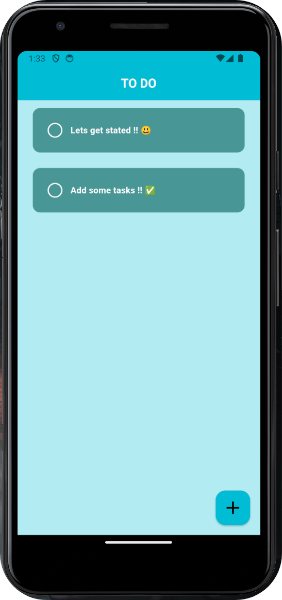
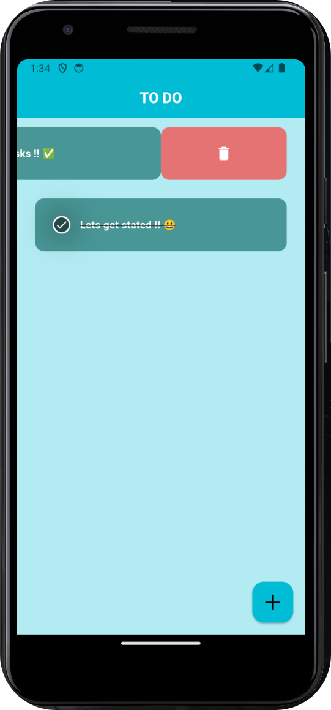

# My Tasks App 🎯


Welcome to the **My Tasks** app! This is a simple and intuitive to-do list application built with Flutter. Keep track of your tasks efficiently and stay organized! 🗂️

## Features ✨
- **Add Tasks**: Quickly add new tasks with ease. 📝
- **Complete Tasks**: Mark tasks as completed by tapping the checkbox. ✅
- **Delete Tasks**: Swipe to delete tasks you no longer need. ❌
- **Audio Feedback**: Enjoy sound notifications for completed and deleted tasks. 🔊

## Screenshots 📸



## Tech Stack 💻
- **Flutter**: The framework used to build the app.
- **Hive**: For local data storage.
- **Audioplayers**: To play sounds.
- **Flutter Slidable**: For swipe actions on tasks.

## Getting Started 🚀
To get a local copy up and running, follow these simple steps:

1. **Clone the repository**:
   ```bash
   git clone https://github.com/yourusername/My-Tasks.git
   
## Author 💬 
℗ by Fahim Saki
